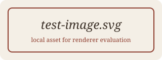

# Links and Images

## Inline links

[Simple link](https://example.com)

[Link with title](https://example.com "Example title")

[Link with **bold** text](https://example.com)

Empty link text: 

## Reference links

[Reference link][ref]

[Collapsed reference][]

[Shortcut reference]

[ref]: https://example.com/reference "Reference title"
[Collapsed reference]: https://example.com/collapsed
[shortcut reference]: https://example.com/shortcut

## Autolinks

<https://example.com/autolink>

<mailto:someone@example.com>

## Bare URLs (GFM autolink extension)

www.example.com and https://gfm.example.com/bare — GFM linkifies bare URLs; check whether the engine does.

## Images

Relative image (tests base-path resolution for local files):

Image with alt only:

Inline image inside text  within a paragraph.

Broken image (missing file — check the fallback rendering):

Remote image (may be blocked offline):

## Links with tricky destinations

[URL with parentheses](https://example.com/path_(with_parens))

[Angle-bracket destination](<https://example.com/spaces in path>)
